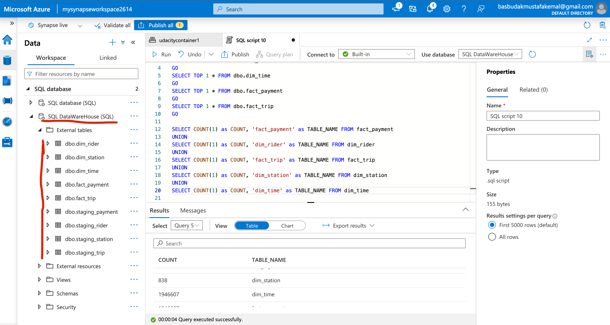

# Building-an-Azure-Data-Warehouse-for-Bike-Share-Data-Analytics

Divvy is a bikesharing program in Chicago, Illinois USA that allows riders to purchase a pass at a kiosk or use a mobile application to unlock a bike at stations around the city and use the bike for a specified amount of time. The bikes can be returned to the same station or another station. The City of Chicago makes the anonymized bike trip data publicly available for projects like this where we can analyze the data. due to the anonymity of the data, fake rider and account profiles, along with fake payment data, have been created to accompany the data from Divvy

The goal of this project is to develop a data warehouse solution using Azure Synapse Analytics and more specifically to:

* Task 1: Create your Azure resources (Azure PostgreSQL,Azure Synapse workspace,)

    Note:   Use the built-in serverless SQL pool and database within the Synapse workspace

* Task 2: Design a star schema (lucid)

* Task 3: Create the data in PostgreSQL (pgadmin4)

* Task 4: EXTRACT the data from PostgreSQL

* Task 5: LOAD the data into external tables in the data warehouse

* Task 6: TRANSFORM the data to the star schema

## Dataset 

Here is the The dataset looks like:

## Star Schema

The data from the original ERD  was transformed into the new schema presented below. The new schema has two fact tables one for trips (fact_trip) and the other for payments (fact_payments). Others is dimention tables.

Here is the Star Schema.  

## Task 1: Create your Azure resources (Azure PostgreSQL,Azure Synapse workspace,)

Create an Azure PostgreSQL database
Create an Azure Synapse workspace. Note that if you've previously created a Synapse Workspace, you do not need to create a second one specifically for the project.
Use the built-in serverless SQL pool and database within the Synapse workspace
In the cloud lab Azure environment, you will only be able to use the built-in serverless SQL Pool.

## Task 3: Create the data in PostgreSQL (pgadmin4)

To prepare your environment for this project, you first must create the data in PostgreSQL. This will simulate the production environment where the data is being used in the OLTP system. This can be done using the Python script provided for you in Github: `ProjectDataToPostgres.py`

## Task 4: EXTRACT the data from PostgreSQL

In Azure Synapse workspace, Use the ingest wizard to create a one-time pipeline that ingests the data from PostgreSQL into Azure Blob Storage. This will result in all four tables being represented as text files in Blob Storage, ready for loading into the data warehouse.

## Task 5: LOAD the data into external tables in the data warehouse

In Blob storage, the files will be shown in the data lake node in the Synapse Workspace. From here, Use the script-generating function to load the data from blob storage into external staging tables in the data warehouse you created using the serverless SQL Pool.

## Task 6: TRANSFORM the data to the star schema

Will write SQL scripts to transform the data from the staging tables to the final star schema you designed.

##  Scripts

To fill the Postgres SQL database with the data you can run the ProjectDataToPostgres.py script. Please provide the credentials of the database inside the script.

The create_scripts file contains all the SQL scripts for the creation of all the tables of the STAR SCHEMA.

Used test.sql and test.sql scripts for Proof of Load all code and data. 

External scripts are contain all the SQL scripts for the creation of all the external tables.
